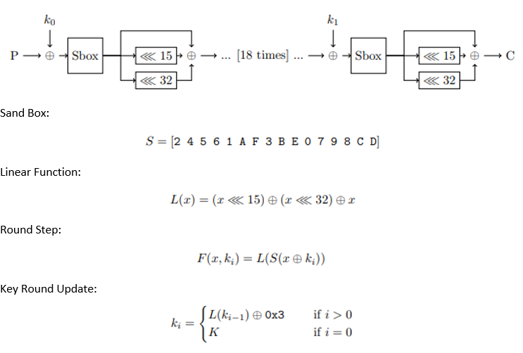

### Cipher

### Known Data
PlainText 
CipherText 
### Attack Implemented
BruteForce 
By implementing the cipher we run over all the possible keys upon the given PlainText and check if the CalculatedCipherText equals to the CipherText 
The key for success here is to use optimized algorithm for encruption and CUDA 
### Directory Structure
Cipher.pdf 		- Cipher specification 
Cipher_C 		- Cipher breaking implemented in C, build using make file 
Cipher_CPP 		- Cipher breaking implemented in CPP, build using Visual Studio 
Cipher_Cuda 	- Cipher breaking implemented in CUDA, build using Visual Studio 
Cipher_Python 	- Cipher implemented in Python (no breaking) 
### How to Run
Define testcase variable accordingly to desired key length breaking: 
0 – 20 bit key 
1 – 32 bit key 
Run, wait until program stops and gives the Key 
### Run Time
20 bit key, should take around 1 second for all implementations 
32 bit key, should take around 3 minutes for the C and CPP and 12 seconds for CUDA  
